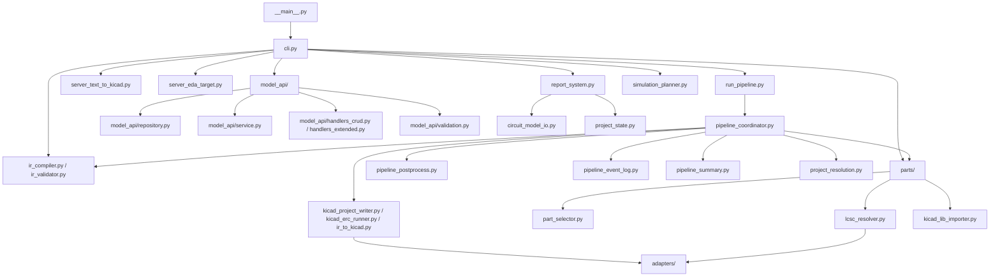

# `src` 结构图与重构建议

本文档用于梳理 `src/kicad_suite/` 当前的目录关系，并给出一套更清晰的分层建议，方便后续逐步重构。

## 当前结构

```text
src/kicad_suite/
├─ __main__.py                  # Python 入口
├─ cli.py                       # 总命令行入口
├─ run_pipeline.py              # pipeline CLI 包装
├─ server_text_to_kicad.py      # text-to-kicad 服务入口
├─ server_eda_target.py         # EDA target 服务入口
├─ circuit_pipeline.py          # 旧的总流水线/公共工具集合
├─ pipeline_coordinator.py      # 主编排层
├─ pipeline_postprocess.py      # 导出后的后处理
├─ pipeline_event_log.py        # 运行事件日志
├─ pipeline_summary.py          # pipeline 汇总
├─ project_resolution.py        # 项目解析结果写回
├─ project_state.py             # 项目状态管理
├─ report_system.py             # 报告生成
├─ simulation_planner.py        # 仿真计划生成
├─ artifact_validator.py        # 产物校验入口
├─ circuit_model_io.py          # circuit-model 读写与路径解析
├─ ir_compiler.py               # source model -> IR
├─ ir_validator.py              # IR 校验
├─ ir_to_kicad.py               # IR -> KiCad execution plan
├─ compile_kicad_execution_plan.py
├─ kicad_erc_runner.py          # ERC 执行
├─ kicad_project_writer.py      # KiCad project/schematic 写出
├─ pcb_generator.py             # 生成 PCB
├─ schematic_layout_rules.py    # 原理图布局规则
├─ pin_manager.py               # 引脚管理
├─ symbol_footprint_resolver.py # 符号/封装映射
├─ jlc_api.py                   # JLC 查询封装
├─ jlc_installer.py             # JLC 下载/安装
├─ lcsc_resolver.py             # LCSC 解析与搜索后端
├─ easyeda_parser.py            # EasyEDA 解析
├─ easyeda_converter.py         # EasyEDA -> KiCad 转换
├─ part_selector.py             # 器件筛选
├─ kicad_lib_importer.py        # KiCad 库导入
├─ ngspice_regression_test.py   # 仿真回归测试
├─ adapters/
├─ model_api/
├─ parts/
├─ validation/
└─ schema_versions.py / schema_contracts.py / env_utils.py
```

## 当前关系



## 现在最大的问题

1. `cli.py` 太像“总调度中心”，既负责命令行解析，也负责业务分发和项目状态更新。
2. `circuit_pipeline.py` 历史包袱较重，既包含环境探测，又包含大量兼容/工具逻辑。
3. `pipeline_coordinator.py` 目前是最重要的编排层，但它和 `server_text_to_kicad.py`、`run_pipeline.py` 的边界还不够清晰。
4. `model_api/` 已经是一个独立子系统，但现在和主流程共用大量上层模块。
5. `parts/`、`validation/`、`adapters/` 已经分层了，但部分辅助函数仍然被跨目录复用，导致依赖有点“网状”。

## 推荐的目标结构

建议按“入口层 / 编排层 / 领域子系统 / 外部适配层”来收口：

```text
src/kicad_suite/
├─ entrypoints/
│  ├─ cli.py
│  ├─ run_pipeline.py
│  ├─ server_text_to_kicad.py
│  └─ server_eda_target.py
├─ orchestration/
│  ├─ pipeline_coordinator.py
│  ├─ pipeline_postprocess.py
│  ├─ pipeline_event_log.py
│  ├─ pipeline_summary.py
│  └─ project_resolution.py
├─ model/
│  ├─ circuit_model_io.py
│  ├─ ir_compiler.py
│  ├─ ir_validator.py
│  ├─ ir_to_kicad.py
│  └─ compile_kicad_execution_plan.py
├─ parts/
├─ model_api/
├─ validation/
├─ adapters/
└─ tools/
   ├─ jlc_api.py
   ├─ jlc_installer.py
   ├─ lcsc_resolver.py
   ├─ easyeda_parser.py
   ├─ easyeda_converter.py
   └─ symbol_footprint_resolver.py
```

这个结构的目标不是“把所有文件都搬走”，而是让每一层只做一类事：

- `entrypoints/` 只接命令，不承载业务
- `orchestration/` 只做流程编排
- `model/` 只处理模型转换与校验
- `parts/` 只负责器件选择/解析/导入
- `validation/` 只负责结果校验
- `adapters/` 只包外部工具接口
- `tools/` 只包 JLC/EasyEDA/LCSC 这类外部数据和解析逻辑

## 建议的迁移顺序

1. 先不搬文件，只先把职责边界稳定下来。
2. 把 `cli.py` 中和业务无关的部分抽成独立入口模块。
3. 把 `circuit_pipeline.py` 里的历史兼容逻辑逐步拆出，保留核心诊断函数。
4. 把 `pipeline_coordinator.py` 拆成更薄的 orchestration 层。
5. 再考虑物理移动 `jlc_*`、`easyeda_*`、`symbol_footprint_resolver.py` 这类工具模块。

## 我建议优先动的文件

如果要先做一轮最有收益的整理，优先级大致是：

1. `cli.py`
2. `pipeline_coordinator.py`
3. `circuit_pipeline.py`
4. `server_text_to_kicad.py`
5. `model_api/handlers_extended.py`

这些文件最像“总线”，拆清楚之后，整个 `src` 的读感会立刻好很多。

